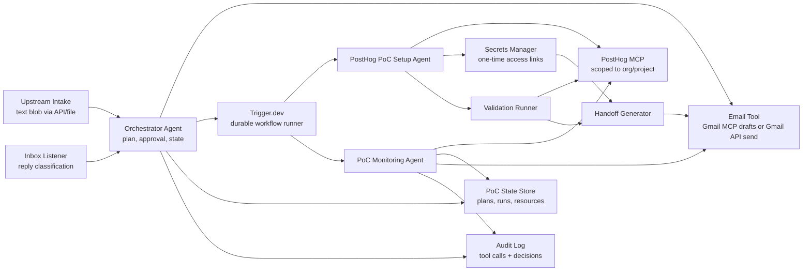
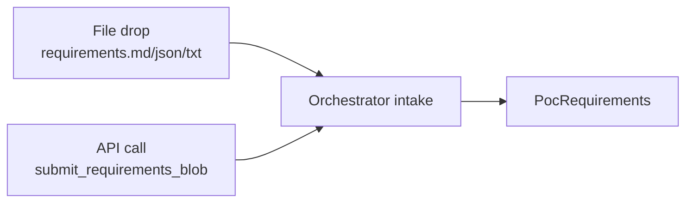
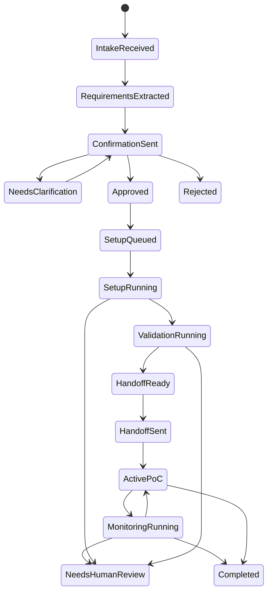
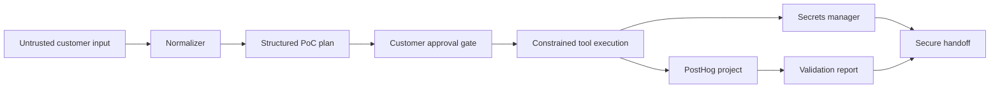

# PostHog PoC Automation Architecture

## Purpose

This system automates the journey from a buyer discovery call to a working PostHog proof of concept. It receives a requirements text blob from a black-box call assistant or another upstream source, confirms the plan with the customer, configures PostHog, validates the setup, and sends a secure handoff package with testing instructions.

Detailed implementation plans live in [docs](./docs/00-index.md).

## Architecture Summary



## Core Components

### Upstream Intake / Call Assistant

Black-box upstream component. Its internal call, audio, transcription, summarization, and assistant implementation are out of scope for this system.

The only expected integration is a text requirements blob submitted to the orchestrator by API call or file drop. The blob may be a transcript summary, notes, or a structured summary rendered as text.

It should not call PostHog tools directly, and the architecture should not depend on any call-assistant-specific technical details.

## Intake Boundary

The orchestrator accepts one canonical intake shape:



The upstream source is interchangeable as long as it can provide:

- Requirements text.
- Optional customer/contact hints.
- Optional source metadata for traceability.
- Optional structured hints that the orchestrator may validate or ignore.

### Orchestrator Agent

The orchestrator owns the customer-facing workflow:

- Normalize call-assistant output into structured requirements.
- Detect missing details and assumptions.
- Generate a customer-readable PoC plan.
- Send the confirmation email.
- Wait for approval or changes.
- Trigger the PostHog setup workflow.
- Track lifecycle state.
- Generate and send the final handoff.

The orchestrator is the only component that decides when setup can start.

### Trigger.dev Workflow Runner

Trigger.dev runs the durable workflow tasks:

- `intake-posthog-poc`
- `prepare-confirmation`
- `wait-for-customer-approval`
- `setup-posthog-poc`
- `validate-posthog-poc`
- `send-poc-handoff`
- `monitor-gmail-inbox`
- `monitor-active-poc`

Use waitpoint tokens for human-in-the-loop approval and use tags such as `poc:{pocId}`, `product:posthog`, and `customer:{companySlug}` for observability.

### PostHog PoC Setup Agent

The setup agent owns PostHog-specific work only:

- Resolve target PostHog org/project.
- Configure project settings.
- Create actions, dashboards, insights, cohorts, flags, surveys, alerts, and subscriptions.
- Generate SDK setup instructions.
- Store credential references.
- Return a structured setup result.

It should use a constrained PostHog MCP session pinned to the target org/project.

### Validation Runner

The validation runner proves the setup is ready:

- Sends synthetic events when a project API key is available.
- Reads PostHog schema.
- Runs dashboards, insights, and query wrappers.
- Checks optional assets such as feature flags, surveys, and alerts.
- Produces a `pass`, `warn`, or `fail` report.

### Handoff Generator

The handoff generator creates the final customer email. It includes project links, dashboard links, testing plan, validation status, known gaps, owner/contact, and one-time secret links.

It must reject any handoff body containing raw credentials.

### PoC Monitoring Agent

The monitoring agent owns post-handoff PoC success tracking. It runs after `handoff_sent`/`handoff_sent_with_gaps`, reads PostHog usage data, compares observed usage to the approved `PocPlan` and setup baseline, and produces monitoring reports.

It should answer:

- Whether the customer is actively using the PoC.
- Whether planned events, funnels, dashboards, flags, surveys, or replay assets are receiving real customer activity.
- Whether each success criterion is met, partially met, blocked, not met, or unknown.
- Whether usage has drifted from the original setup plan.
- Whether an operator or customer follow-up is needed before the review date.

It must be read-only by default. Remediation, plan revision, teardown, or production-impacting changes require a separate approval path.

## Lifecycle



## Trust Boundaries

Customer speech, transcripts, and emails are untrusted input. They can shape a plan, but they must not directly execute tool calls.



## External Tool Surfaces

Required tool groups:

- Call intake API.
- Email send API.
- Gmail MCP draft/inbox tools (`create_draft`, `search_threads`, `get_thread`, optional `label_thread`).
- Gmail API direct-send fallback (`users.messages.send`) for outbound confirmation and handoff messages.
- Trigger.dev workflow API.
- PostHog MCP.
- Secrets manager.
- Synthetic event sender.
- Usage and success-criteria monitor.
- Audit logger.
- Optional web/docs search.

The exact contracts are defined in [tool contracts](./docs/04-tool-contracts.md).

## PostHog MCP Policy

Use the hosted PostHog MCP endpoint:

```text
https://mcp.posthog.com/mcp
```

Production sessions should be:

- Authenticated with a scoped credential.
- Pinned to the target organization/project.
- Filtered to the required feature groups or exact tools.
- Denied destructive tools unless a human approval gate is added.

Default safe tool groups:

- Workspace/project read.
- Docs search.
- Project settings update.
- Actions.
- Dashboards.
- Insights and query wrappers.
- Data schema.
- SQL validation.
- Cohorts.
- Feature flags with no autonomous delete.
- Surveys.
- Alerts/subscriptions.
- SDK Doctor.
- Query tools for usage monitoring, including event counts, funnels, trends, dashboard widgets, survey stats, feature flag evaluation, and session recording lists.

## Data Stores

The implementation exposes one async `PocStore` contract. This PoC uses JSON file storage by default and a local SQLite file when a simple database is useful. It intentionally avoids PGSQL and production database setup.

Minimum persistence:

- `pocs`: lifecycle status, customer, product, active plan version.
- `poc_plans`: versioned structured plans.
- `approval_events`: approval source, approver, timestamp, evidence.
- `workflow_runs`: Trigger.dev run IDs and metadata.
- `posthog_resources`: created/updated resource IDs and URLs.
- `validation_reports`: validation checks and status.
- `monitoring_runs`: scheduled monitoring runs, window, status, risk level, and recommended actions.
- `monitoring_reports`: usage snapshots, success-criteria progress, plan drift, and follow-up drafts.
- `email_threads`: sent/received message IDs.
- `audit_events`: external actions, status, errors, and summaries.
- `secret_refs`: references only, not raw secret values.

## Security Requirements

- Do not email raw secrets.
- Use one-time secret links with expiry.
- Pin PostHog MCP to org/project.
- Constrain PostHog MCP tools per workflow phase.
- Require human approval for destructive or production-impacting operations.
- Keep customer input separate from tool instructions.
- Write audit events for every external mutation.
- Validate final handoff for accidental secret leakage.

## Failure Handling

- Retry transient email and MCP read failures.
- Retry idempotent writes only after checking whether the resource already exists.
- Escalate repeated setup failures to a human operator.
- Block handoff on failed validation unless a human override is recorded.
- Send handoff with warnings only when core success criteria pass.

## Implementation References

- [Orchestrator plan](./docs/02-orchestrator-plan.md)
- [PostHog setup plan](./docs/03-posthog-poc-setup-plan.md)
- [Tool contracts](./docs/04-tool-contracts.md)
- [Data contracts](./docs/05-data-contracts.md)
- [Trigger.dev workflows](./docs/06-trigger-workflows.md)
