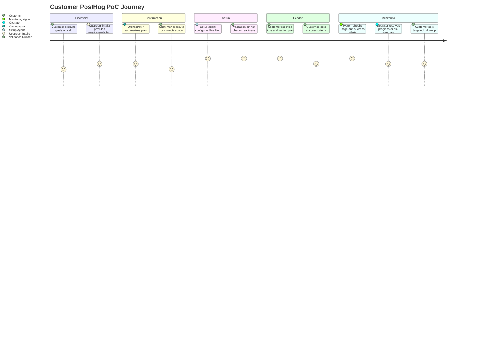
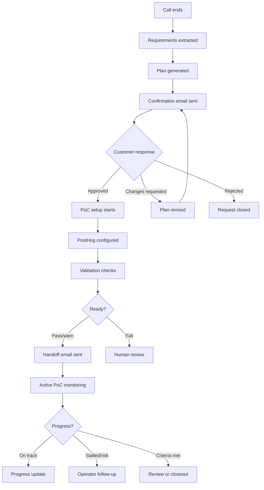
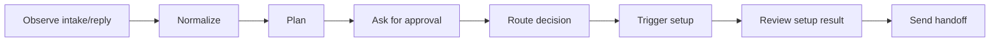
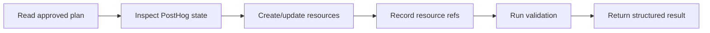
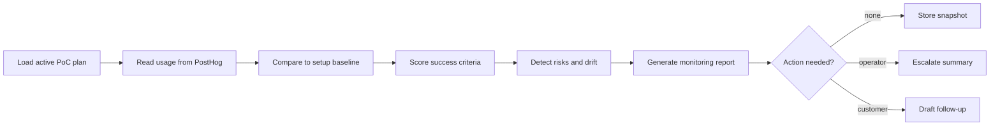

# PostHog PoC Automation Design

## Product Concept

The product is an AI-assisted PoC setup system for PostHog. It helps a customer move from "we want to evaluate PostHog" to "we have a configured PoC with a clear testing plan" with minimal manual coordination.

The MVP focuses only on PostHog. The system should be optimized for a solutions engineer or sales engineer who wants to turn a discovery call into a working demo environment quickly and safely.

The product should not stop at handoff. A useful PoC system also needs to monitor whether the customer is using the PoC, whether usage is moving toward the agreed success criteria, and whether the original PoC plan still matches the observed behavior. This is the PoC Success Monitoring feature: a scheduled post-handoff loop that turns PostHog usage data into operator/customer follow-up decisions.

## Primary User Journey

## Design Principles

1. Confirmation before configuration.
2. PostHog-specific first, generalized later.
3. Structured contracts over free-form handoffs.
4. Safe tool execution with least privilege.
5. Secure credential delivery by default.
6. Validation before "ready" messaging.
7. Human escalation for ambiguity, destructive changes, or failed validation.
8. Monitor PoC value after handoff, not only setup completion.

## System Personas

### Customer / Buyer

Needs:

- A clear PoC plan.
- Minimal setup confusion.
- Access to the right PostHog project.
- A concrete testing plan.
- Confidence that privacy/security assumptions were respected.

### Solutions Engineer / Operator

Needs:

- A reliable automation path.
- Visibility into status and failures.
- Audit trail of what changed.
- Ability to approve risky actions.
- Easy handoff package generation.

### Orchestrator Agent

Needs:

- Clear schemas.
- Limited tools.
- State machine.
- Approval gates.
- Access to email/inbox workflow.

### PostHog Setup Agent

Needs:

- Approved setup plan.
- Scoped PostHog MCP access.
- Resource naming conventions.
- Idempotency strategy.
- Validation feedback.

### PoC Monitoring Agent

Needs:

- Approved `PocPlan`, `SetupResult`, and original validation baseline.
- Read-only PostHog MCP access to usage, events, schema, dashboards, insights, recordings, flags, surveys, and query results.
- A durable monitoring schedule and previous snapshots.
- Rules that map observed product usage back to success criteria.
- Ability to recommend follow-up messages, human escalations, plan revisions, or teardown/completion actions.

## User Experience Flow

## Confirmation Experience

The confirmation email should be short enough for a buyer to approve quickly, but precise enough to prevent surprise configuration.

It must include:

- Goal.
- Success criteria.
- Scope.
- Assumptions.
- Open questions.
- Testing plan preview.
- Approval mechanism.

The customer can approve by:

- Clicking an approval link.
- Replying "Approved".
- Sending corrections in the same thread.

## Handoff Experience

The handoff email is the customer's operating guide for the PoC.

It must include:

- PostHog project link.
- Main dashboard link.
- Secure credential link.
- Credential expiry.
- What was configured.
- Event taxonomy.
- SDK setup instructions.
- Testing plan.
- Validation status.
- Known gaps.
- Owner/contact.
- Review and teardown dates.

## Agent Interaction Design

### Orchestrator Agent Loop

The orchestrator should not expose PostHog mutation tools to itself except through the setup workflow boundary.

### Setup Agent Loop

The setup agent should not email customers directly. It returns setup data to the orchestrator/handoff generator.

### Monitoring Agent Loop

The monitoring agent is read-first. It should not mutate the customer’s PostHog configuration unless a separate human-approved remediation workflow is added.

## Plan Quality Rules

A plan is acceptable only if:

- Product is `posthog`.
- Customer contact exists.
- Business goal exists.
- At least one success criterion exists.
- Target org/project strategy is known.
- Setup scope is explicit.
- Security assumptions are explicit.
- Open questions are visible.

## PoC Testing Design

Testing should map to success criteria, not generic PostHog usage.

Baseline tests:

1. SDK initialization sends a test event.
2. Identity strategy works for a test user.
3. Primary funnel reflects synthetic or real test activity.
4. Core feature usage event appears in the dashboard.
5. Optional configured assets work: flags, surveys, session replay, alerts.

## PoC Success Monitoring Design

Monitoring starts after the handoff is sent and the PoC enters `active_poc`. It should run on a schedule, for example daily during the first week and before the scheduled review date. Each run produces a `PocMonitoringReport`.

Monitoring should answer:

- Is the customer logging into or otherwise using the PostHog project?
- Are expected events arriving from the customer environment, not only synthetic validation?
- Are event volumes, unique users, and recency consistent with the testing plan?
- Are the configured dashboards, insights, flags, surveys, or recordings being used?
- Which success criteria have evidence, which are blocked, and which are still untested?
- Has actual usage drifted from the original PoC plan, for example different events, a different app environment, or missing identity calls?
- Does the PoC need a reminder, technical help, plan revision, human escalation, or closeout?

Baseline monitoring dimensions:

1. Account activity: project access, recent user activity when available, credential-link consumption, and last known customer touchpoint.
2. Data ingestion: event counts by planned event, first seen, last seen, unique users, and environment/source properties.
3. Success criteria progress: per-criterion status of `met`, `partially_met`, `not_met`, `blocked`, or `unknown`, with evidence links.
4. Usage patterns: repeated usage, funnel progression, dashboard/insight query results, session replay availability, survey responses, and feature flag evaluation when configured.
5. Plan drift: observed events or behavior that were not in the approved plan, and approved events that never appeared.
6. Risk signals: no activity after handoff, only synthetic events, broken schema, dashboard queries failing, credential link unused, review date approaching, or validation regressions.

Monitoring outputs:

- Operator report with status, evidence, risks, and suggested next actions.
- Optional customer follow-up draft, such as a reminder, troubleshooting checklist, or success summary.
- Updated lifecycle recommendation: keep monitoring, escalate, revise plan, schedule review, mark success, or prepare teardown.

## Resource Naming Design

Use stable names to make automation idempotent:

- Dashboard: `PoC - {customerCompany} - {pocId}`
- Insight: `{pocId}: {insightName}`
- Action: `{pocId}: {actionName}`
- Feature flag: `{companySlug}-{pocSlug}-{flagKey}`
- Survey: `PoC {pocId}: {surveyName}`
- Tags: `poc:{pocId}`, `source:poc-automation`

## Safety Design

Autonomous setup can create and update approved PoC resources. It should not autonomously:

- Delete dashboards, insights, persons, flags, surveys, or CDP functions.
- Launch experiments.
- Ship experiment variants.
- Bulk delete anything.
- Change production-impacting settings without approval.

## MVP Screens or Surfaces

The first build does not require a full UI. Minimum surfaces:

- Orchestrator intake endpoint or file importer for a requirements text blob.
- Internal run/status logs and `GET /pocs` operator status API.
- Confirmation email.
- Approval page at `/approval` and email reply handling.
- Final handoff email.

Optional operator UI:

- PoC status list.
- Active workflow run.
- Current lifecycle state.
- Approval status.
- Created PostHog resources.
- Validation report.
- Latest monitoring report and risk level.
- Success criteria progress by criterion.
- Escalation actions.

## Success Metrics

MVP system metrics:

- Time from call summary to confirmation email.
- Approval-to-handoff completion time.
- Setup success rate.
- Validation pass/warn/fail rate.
- Active PoC monitoring coverage.
- Percentage of PoCs with real customer activity after handoff.
- Success criteria met/partially met/not met rate.
- Number of human escalations.
- Number of handoffs with missing information.

Customer success metrics:

- Customer can access PostHog.
- Customer can send or inspect test events.
- Dashboard reflects success criteria.
- Real customer usage is visible before the review date.
- Monitoring report identifies the next best action.
- PoC review can happen from generated links and testing plan.

## Detailed References

- [Architecture details](./docs/01-architecture.md)
- [Customer email templates](./docs/07-customer-handoff-template.md)
- [Implementation roadmap](./docs/08-implementation-roadmap.md)
- [PoC success monitoring](./docs/10-poc-success-monitoring.md)
