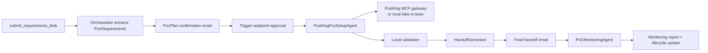

# PostHog PoC Automation

This repo is building the orchestrator agent and PostHog PoC setup agentic system described in [ARCHITECTURE.md](./ARCHITECTURE.md) and [DESIGN.md](./DESIGN.md).

## Current Scope

Implemented so far:

- TypeScript project scaffold.
- DeepSeek V4 Pro/Flash config and OpenAI-compatible JSON client.
- Orchestrator intake flow for `submit_requirements_blob`.
- Canonical PoC contracts and in-memory PoC state store.
- PostHog PoC setup agent with typed PostHog tool gateway.
- Local in-memory tools for email, inbox, approval waitpoints, secrets, audit logging, PostHog resources, and validation.
- Handoff generator with secret-safety checks.
- Local workflow service that approves a plan, runs setup, validates, and sends handoff.
- File-backed PoC store for workflow runs that need state across process/task boundaries.
- SQLite-backed PoC store using Node's built-in `node:sqlite` when a simple database file is useful.
- Trigger.dev config and task wrappers for the PostHog PoC workflow.
- Dependency-free HTTP API for requirements intake and approval completion.
- Blocking clarification email when a PostHog project target is missing.
- Human-readable approval page served by the API at `/approval`.
- Operator status/read APIs for PoC lists and PoC detail.
- PostHog MCP-backed gateway adapter with project pinning and tool filtering support.
- Failed PostHog setup calls produce a stored failed setup report and route the PoC to human review.
- Gmail MCP remote bridge for outbound draft creation and inbox polling.
- Raw Gmail API direct-send fallback via `users.messages.send`.
- Inbound email reply processing with DeepSeek Flash classification.
- Gmail MCP inbound email normalizer for messages read by the connector.
- Trigger.dev inbox monitor task that uses Gmail MCP `search_threads`, `get_thread`, and optional `label_thread`.
- PostHog MCP-backed validation checks for project readability, dashboard widgets, schema, and SQL smoke queries.
- Synthetic PostHog event capture during setup validation when `POSTHOG_PROJECT_API_KEY` is configured.
- Post-capture synthetic event visibility retries through PostHog MCP `execute-sql`.
- Encrypted file-backed secrets store with one-time credential links served at `/secrets/:token`.
- **PoC Pilot** — a Vite + React + Tailwind operator console and customer journey
  frontend over the JSON API (see [`web/`](./web/) and [`docs/ux/`](./docs/ux/README.md)).
- PoC success monitoring after handoff with usage snapshots and monitoring reports.
- Request body validation with zod on all POST endpoints (`400` on malformed input).
- In-process workflow mode (`WORKFLOW_MODE=local`) so the HTTP API runs the full flow with real results, no Trigger.dev deploy required.
- Offline happy-path demo runner (`npm run demo`) using in-memory tools and a deterministic LLM.
- Requirements file importer for `.md`/`.txt`/`.json` blobs.
- Customer-facing plan summary (`customerSummaryMarkdown`) plus broader missing-detail detection that surfaces confirmable gaps as open questions.
- Validation trends and funnel query-wrapper checks (run when expected events exist).
- Monitoring usage snapshots extended to survey responses, session recordings, and feature-flag evaluations.

Not implemented yet:

- Deployment packaging for the API and Trigger.dev workers.

## Frontend — PoC Pilot

`web/` is the human-facing layer over this backend: a pipeline board and PoC detail
view for the operator (Solutions Engineer), plus polished approval and handoff pages
for the customer. It reads the existing JSON API — no backend changes needed.

```bash
npm run build && npm run seed && npm run api:start   # backend + seeded pipeline on :3000
cd web && npm install && npm run dev                 # app on http://localhost:5173
```

Surfaces, user stories, flows, journey maps, and a 2-minute demo script live in
[`docs/ux/`](./docs/ux/README.md); screenshots in [`docs/screens/`](./docs/screens/).
The board, detail, approval-render, and handoff are fully live from the seed with no
keys; the **New PoC** intake calls the orchestrator and needs `DEEPSEEK_API_KEY`.

## Environment

The app expects:

```bash
DEEPSEEK_API_KEY=...
```

Optional:

```bash
DEEPSEEK_BASE_URL=https://api.deepseek.com
POC_STORE_MODE=sqlite
POC_STORE_PATH=.data/pocs.json
SQLITE_DB_PATH=.data/pocs.sqlite
EMAIL_FROM="PoC Team <poc@example.com>"
EMAIL_MODE=local
GMAIL_MCP_ENDPOINT=https://gmailmcp.googleapis.com/mcp/v1
GMAIL_MCP_USER_PROJECT=999302008289
GMAIL_MCP_PROVIDER=google
GMAIL_MCP_DELIVERY_MODE=draft
GMAIL_MCP_ACCESS_TOKEN=ya29...
GMAIL_API_BASE_URL=https://gmail.googleapis.com
GMAIL_API_USER_ID=me
GMAIL_API_ACCESS_TOKEN=ya29...
GMAIL_INBOX_QUERY="in:inbox newer_than:7d -in:draft"
GMAIL_INBOX_MAX_THREADS=10
GMAIL_PROCESSED_LABEL_IDS=Label_123
GOOGLE_OAUTH_CLIENT_ID=...
GOOGLE_OAUTH_CLIENT_SECRET=...
GOOGLE_OAUTH_SCOPES="openid email profile https://mail.google.com/ https://www.googleapis.com/auth/gmail.compose https://www.googleapis.com/auth/gmail.readonly"
GOOGLE_OAUTH_TOKEN_STORE_PATH=.data/google-oauth-token.json
GMAIL_MCP_SMOKE_TO=gautamgsabhahit@gmail.com
SECRETS_MODE=encrypted_file
SECRET_ENCRYPTION_KEY=use-a-long-random-secret-or-32-byte-base64-key
SECRETS_STORE_PATH=.data/secrets.json
SECRETS_BASE_URL=http://localhost:3000/secrets
POSTHOG_MCP_API_KEY=phx_...
POSTHOG_PROJECT_API_KEY=phc_...
POSTHOG_PROJECT_ID=...
POSTHOG_ORGANIZATION_ID=...
POSTHOG_MCP_ENDPOINT=https://mcp.posthog.com/mcp?tools=project-get,project-settings-update,action-create,dashboard-create,insight-create,cohorts-create,create-feature-flag,experiment-create,survey-create,alert-create,read-data-schema,execute-sql
POSTHOG_SYNTHETIC_VERIFY_ATTEMPTS=5
POSTHOG_SYNTHETIC_VERIFY_DELAY_MS=2000
TRIGGER_PROJECT_REF=proj_...
TRIGGER_API_URL=https://api.trigger.dev
TRIGGER_SECRET_KEY=tr_dev_...   # required at runtime when WORKFLOW_MODE=trigger (dashboard "API keys" page)
TRIGGER_ACCESS_TOKEN=tr_pat_... # only for `npm run trigger:deploy` / CI; `trigger.dev login` covers local dev
APPROVAL_BASE_URL=http://localhost:3000/approval
```

Storage defaults to a local SQLite file so month-long PoC state survives API restarts. Use `SQLITE_DB_PATH` to choose the file path, or set `POC_STORE_MODE=file` for the simpler JSON file store. This PoC intentionally avoids PGSQL.

Set `EMAIL_MODE=gmail_mcp` to have the app call a Gmail MCP server. The default `GMAIL_MCP_PROVIDER=google` uses Google's Gmail remote MCP tool names: outbound messages become Gmail drafts via `create_draft`; inbox monitoring uses `search_threads` and `get_thread`; processed marking uses `label_thread` with label IDs, not label names. Set `GMAIL_MCP_PROVIDER=workspace` for Workspace MCP-style outbound tool names (`draft_gmail_message` / `send_gmail_message`). `GMAIL_MCP_DELIVERY_MODE=draft` is the safe default; switch it to `send` only after validating the configured MCP server against a test mailbox. See Google's [Gmail MCP setup guide](https://developers.google.com/workspace/gmail/api/guides/configure-mcp-server).

Customer replies are handled as a pre-sales email workflow. DeepSeek classifies ordinary language
replies into approval, requested changes, questions, rejection, or unclear intent. Follow-up
questions to the buyer must ask for business context (goals, definitions, audience, pages, review
window), not technical implementation choices such as SQL, event property names, MCP tools, or
dashboard widget types.

For Google-hosted Gmail MCP, set `GMAIL_MCP_USER_PROJECT` to the Google Cloud project number or ID that has Gmail MCP API enabled. The signed-in test user must have `roles/serviceusage.serviceUsageConsumer` on that project so Google accepts the `x-goog-user-project` quota header.

Set `EMAIL_MODE=gmail_api` to send directly through Gmail REST `users.messages.send`. This path builds a text RFC 2822 MIME email, base64url-encodes it into `raw`, and posts to Gmail. The OAuth token needs one of Gmail's send-compatible scopes such as `https://www.googleapis.com/auth/gmail.send` or `https://www.googleapis.com/auth/gmail.compose`.

For UI-based local testing, set `GOOGLE_OAUTH_CLIENT_ID` and `GOOGLE_OAUTH_CLIENT_SECRET`, start the API in `WORKFLOW_MODE=local`, then open the React app's Settings page and click **Connect Gmail**. The exchanged OAuth access token is stored in `.data/google-oauth-token.json` by default, which is gitignored and can be cleared with **Forget token**. Google redirect URIs are exact-match: if you open Vite at `http://127.0.0.1:5173`, add `http://127.0.0.1:5173/integrations/google/oauth/callback`; if you open `http://localhost:5173`, add `http://localhost:5173/integrations/google/oauth/callback`. If you connect from the API origin directly, use `http://127.0.0.1:3000/integrations/google/oauth/callback`.

For Gmail MCP draft testing, enable both `gmailmcp.googleapis.com` and `gmail.googleapis.com` in the Google Cloud project. Then run:

```bash
npm run build
npm run gmail:mcp:deepseek-draft-smoke -- gautamgsabhahit@gmail.com
```

The smoke script uses DeepSeek V4 Pro to generate the draft payload, calls Gmail MCP `create_draft`, and verifies the draft through Gmail's REST search API.

The configured default model IDs are:

- `deepseek-v4-pro`
- `deepseek-v4-flash`

## Commands

Install dependencies:

```bash
npm install
```

Run tests:

```bash
npm test
```

Type-check/build:

```bash
npm run build
```

Lint and format:

```bash
npm run lint        # report problems (errors fail; warnings inform)
npm run lint:fix    # auto-fix what ESLint can
npm run format      # apply Prettier formatting
npm run format:check
```

Run Trigger.dev locally:

```bash
# First time only: authenticate the CLI with your Trigger.dev account.
npx trigger.dev@4.4.6 login

npm run trigger:dev
```

The repo already ships `trigger.config.ts` and the `trigger/` tasks, so do **not** run
`npx trigger.dev init` — it would overwrite that config. Create the project in the dashboard,
put its `proj_...` ref in `.env` as `TRIGGER_PROJECT_REF`, then `login` and `trigger:dev`.

Run the read-only PostHog MCP smoke check after building:

```bash
npm run build
npm run posthog:mcp:smoke
```

This checks `project-get`, `read-data-schema`, and `execute-sql` against the configured `POSTHOG_PROJECT_ID` without mutating the project.

Run the guarded mutating PostHog MCP smoke check only against a disposable project:

```bash
POSTHOG_MCP_MUTATION_SMOKE=1 npm run posthog:mcp:mutation-smoke
```

This creates temporary actions, dashboards, insights, cohorts, feature flags, experiments, surveys, and alerts using a `poc-smoke-*` prefix. It is meant to validate live PostHog MCP argument shapes before a demo.

Run the offline demo (no credentials needed — full happy path with in-memory tools):

```bash
npm run demo
```

Start the built HTTP API:

```bash
npm run build
npm run api:start
```

Set `WORKFLOW_MODE=local` to run the whole flow in-process so `POST /email/inbound` and `POST /pocs/:pocId/monitoring/run` return real results without a Trigger.dev deploy (still needs `DEEPSEEK_API_KEY`). The default `trigger` mode dispatches to Trigger.dev workers.

Deploy Trigger.dev tasks:

```bash
npm run trigger:deploy
```

Trigger.dev uses `TRIGGER_PROJECT_REF` when available. If it is not set, `trigger.config.ts` uses a local placeholder project ref so TypeScript and local development still work.

The local `WORKFLOW_MODE=local` path is only for offline demos and tests; the expected PoC workflow path is `WORKFLOW_MODE=trigger` against Trigger.dev Cloud.

## Implemented Flow



## Next Build Steps

1. Run `npm run posthog:mcp:smoke` with real PostHog MCP credentials, then validate mutating setup tool argument shapes against a disposable PostHog project.
2. Exercise the Gmail MCP bridge and Gmail API direct-send mode with a real OAuth token and a test inbox label.
3. Extend monitoring into funnel-specific scoring and review-date routing (survey, session-recording, and feature-flag signals are now collected).
4. Add a small operator UI or CLI on top of the status APIs and monitoring reports.
5. Add deployment packaging for the API and Trigger.dev workers.

## Trigger.dev Tasks

Task file:

```text
trigger/posthog-poc-workflow.ts
```

Tasks:

- `posthog-poc-workflow`: full intake -> confirmation email -> Trigger waitpoint approval -> setup -> validation -> handoff flow.
- `setup-approved-posthog-poc`: setup/handoff path when a plan has already been externally approved.
- `process-posthog-poc-email-reply`: asynchronous inbound email approval/revision classifier; approved replies continue into setup, validation, and handoff, while requested changes create a revised plan and resend confirmation.
- `monitor-active-posthog-poc`: post-handoff usage and success-criteria monitor.
- `monitor-gmail-inbox`: polls Gmail MCP for matching inbox threads, normalizes replies, dispatches them to `processEmailReply`, and optionally labels processed threads by label ID.

## HTTP API

The built server exposes:

- `GET /health`
- `GET /approval`: serves the customer approval page for Trigger waitpoint links.
- `GET /secrets/:token`: consumes and renders a one-time secret link.
- `GET /pocs?limit=50`: lists recent PoCs with lifecycle status, customer, active plan, setup, and validation summary.
- `GET /pocs/:pocId`: returns operator detail with requirements, active plan, and setup result when present.
- `GET /pocs/:pocId/monitoring`: lists monitoring reports for a PoC.
- `POST /requirements`: accepts the canonical requirements blob and starts `posthog-poc-workflow`.
- `POST /pocs/:pocId/monitoring/run`: runs an on-demand monitoring check for a PoC.
- `POST /approval/complete`: completes a Trigger waitpoint token using the public access token.
- `POST /email/inbound`: accepts a canonical inbound email reply and processes it.
- `POST /email/inbound/gmail-mcp`: accepts a Gmail MCP read-email result and normalizes it.
- `GET /integrations/google/status`: returns test Gmail OAuth connection status.
- `GET /integrations/google/oauth/start`: starts the local test Google OAuth flow.
- `GET /integrations/google/oauth/callback`: exchanges the Google OAuth code and stores the token in memory.
- `POST /integrations/google/oauth/forget`: clears the in-memory Gmail OAuth token.

Example requirements payload (clears the missing-detail gate and proceeds to the approval flow):

```json
{
  "source": "api",
  "text": "Acme wants to evaluate PostHog for signup activation analytics in their existing PostHog project (project ID 12345, US region). It's a web app. Track events: signup_started, signup_completed, first_value_action. Success means an activation funnel from signup_started to first_value_action for real users within two weeks.",
  "participants": [
    {
      "email": "buyer@acme.test",
      "company": "Acme"
    }
  ],
  "structuredHints": {
    "posthogContext": { "projectId": "12345", "region": "US", "useExistingProject": true },
    "appContext": { "platform": ["web"] },
    "analyticsScope": {
      "events": [
        { "name": "signup_started" },
        { "name": "signup_completed" },
        { "name": "first_value_action" }
      ]
    }
  },
  "sourceMetadata": {
    "sourceId": "requirements-1"
  }
}
```

`structuredHints` is free-form context handed to the extraction LLM. The orchestrator only
advances to plan confirmation once it can resolve a PostHog project, so supply
`posthogContext.projectId` (as above) or name it in `text`. Omit it and the orchestrator
returns `needs_clarification` — the missing-detail gate, not an error. The first participant
email is the confirmation recipient; for the Convinced widget test use
`vgs@getconvinced.ai` so that VGS can reply "approved" from the same thread. This same payload
is what you paste into the Trigger.dev dashboard **Test** tab for the `posthog-poc-workflow`
task; after approval the run continues into setup, validation, and handoff (against in-memory
PostHog fakes unless `POSTHOG_MCP_API_KEY` is set).

Example canonical inbound email payload:

```json
{
  "pocId": "poc_123",
  "message": {
    "id": "inbound-1",
    "threadId": "thread-1",
    "from": "buyer@acme.test",
    "to": ["poc@example.com"],
    "subject": "Re: Please confirm your PostHog PoC plan",
    "textBody": "Approved, please proceed.",
    "receivedAt": "2026-06-04T00:05:00.000Z"
  }
}
```

Example Gmail MCP inbound message shape:

```json
{
  "email": {
    "id": "msg_123",
    "threadId": "thread_123",
    "sender": "buyer@acme.test",
    "toRecipients": ["poc_123@inbound.example.com"],
    "subject": "Re: Please confirm",
    "plaintextBody": "Approved",
    "date": "2026-06-04T00:05:00.000Z"
  }
}
```

The Gmail inbox monitor can process ordinary replies to the confirmation email. If no `pocId`
is passed to `monitor-gmail-inbox`, it resolves the PoC by matching the Gmail `threadId` to the
stored `confirmationThreadId`, then only processes replies from the PoC's customer contacts.
For a focused VGS approval test, set the inbox query to something like
`from:vgs@getconvinced.ai newer_than:7d -in:draft`.
