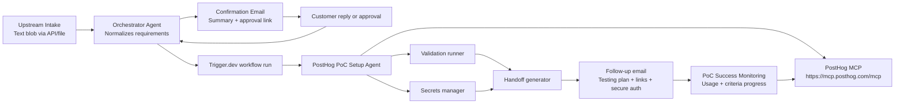

# PostHog PoC Automation Planning Pack

This folder captures the implementation plan for a PostHog-only PoC automation system.

The system starts from a requirements text blob captured by a black-box upstream source such as a call assistant, routes it through an orchestrator agent for confirmation, provisions and configures a PostHog PoC, validates the setup, and sends the customer a handoff message with testing instructions and secure access details.

After handoff, the system should continue as a PoC Success Monitoring loop: scheduled checks compare real PostHog usage against the original success criteria, detect plan drift or inactivity, and recommend operator/customer follow-up.

Source links checked on 2026-06-04:

- PostHog MCP overview: <https://posthog.com/docs/model-context-protocol>
- PostHog MCP tools reference: <https://posthog.com/docs/model-context-protocol/tools>
- PostHog MCP FAQ and advanced setup: <https://posthog.com/docs/model-context-protocol/faq>
- Trigger.dev docs: <https://trigger.dev/docs>
- Trigger.dev tasks: <https://trigger.dev/docs/tasks/overview>
- Trigger.dev wait tokens: <https://trigger.dev/docs/wait-for-token>
- Trigger.dev realtime: <https://trigger.dev/docs/realtime/overview>
- Trigger.dev repo: <https://github.com/triggerdotdev/trigger.dev>

## Files

- [01-architecture.md](./01-architecture.md): system architecture, component boundaries, data flow, and core decisions.
- [02-orchestrator-plan.md](./02-orchestrator-plan.md): orchestrator agent responsibilities, lifecycle, customer confirmation, reply handling, and failure handling.
- [03-posthog-poc-setup-plan.md](./03-posthog-poc-setup-plan.md): PostHog-specific provisioning, configuration, validation, and setup output.
- [04-tool-contracts.md](./04-tool-contracts.md): MCP/API tool surface, PostHog MCP allowlist, email/inbox/secrets/testing/audit tools.
- [05-data-contracts.md](./05-data-contracts.md): structured inputs and outputs for requirements, plans, approvals, setup results, validation, and handoff.
- [06-trigger-workflows.md](./06-trigger-workflows.md): Trigger.dev workflow plan, tasks, retries, waitpoints, and pseudo-code.
- [07-customer-handoff-template.md](./07-customer-handoff-template.md): customer confirmation and handoff templates.
- [08-implementation-roadmap.md](./08-implementation-roadmap.md): MVP roadmap, acceptance criteria, risks, and follow-up work.
- [09-demo-readiness-and-gaps.md](./09-demo-readiness-and-gaps.md): current feature status, real-service validation blockers, and remaining demo gaps.
- [10-poc-success-monitoring.md](./10-poc-success-monitoring.md): post-handoff monitoring, success criteria progress, usage signals, risk levels, and follow-up actions.

## MVP Outcome

The MVP is successful when the system can:

1. Receive a requirements text blob through an API call or file drop.
2. Convert the payload into a customer-readable PostHog PoC plan.
3. Email the plan and wait for approval or changes.
4. Configure a PostHog project using a constrained MCP/API tool surface.
5. Validate that the expected events, dashboards, and queries work.
6. Send a handoff email with testing plan, project links, setup summary, and secure credential delivery links.
7. Monitor active PoCs for real usage, success criteria progress, and risk.
8. Maintain an auditable state machine for the whole PoC lifecycle.

## Top-Level Flow

## Product Boundary

This version only targets PostHog. Do not generalize into a multi-product abstraction yet.

Keep abstractions only where they are needed for system reliability:

- `orchestrator`: customer lifecycle and approval state.
- `posthog_setup`: PostHog-specific configuration and validation.
- `tool_gateway`: constrained access to external systems.
- `handoff_generator`: customer-facing message generation.
- `poc_monitoring`: post-handoff usage and success-criteria tracking.

## Explicitly Out of Scope

The call assistant's audio pipeline, call handling, transcription, summarization model, and runtime architecture are not part of this planning pack. The orchestrator only depends on a text blob submitted by API or file.
