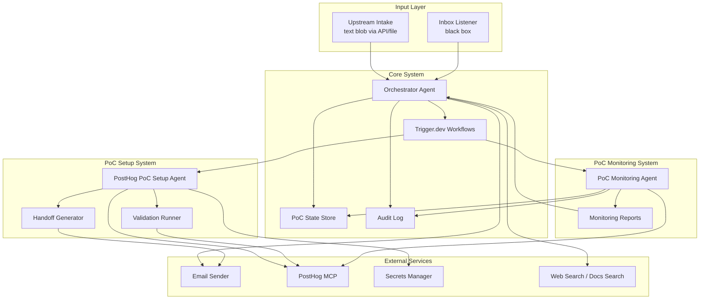
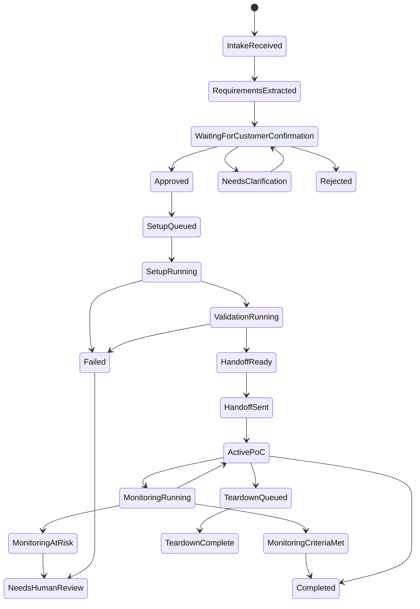
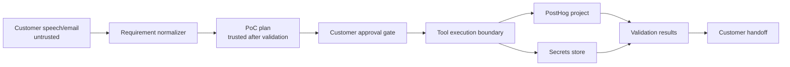

# Architecture Plan

## Goal

Build a PostHog-only PoC automation system that turns buyer requirements into a confirmed PoC plan, configures PostHog, validates the setup, sends the customer a complete handoff package, and monitors the active PoC against the agreed success criteria.

The main engineering focus is the orchestrator and the PostHog PoC setup agent. The call assistant, email provider, inbox provider, PostHog MCP, secrets manager, and workflow runner are treated as isolated black boxes connected through MCP or API calls.

The call assistant's implementation is explicitly out of scope. The orchestrator only requires a requirements text blob delivered by API call or file drop.

## Non-Goals

- Do not support products other than PostHog in the MVP.
- Do not build a generic plugin marketplace or generic SaaS provisioning abstraction.
- Do not email raw passwords or long-lived secrets.
- Do not let the LLM freely access every PostHog MCP tool in production.
- Do not let customer-provided requirements directly execute tool calls without normalization, validation, and approval gates.

## Component Map

## Component Responsibilities

### Upstream Intake / Call Assistant

Black box. Its call/audio/transcription/summarization internals are not specified here. It sends the orchestrator a text blob by API call or file drop.

The text blob may include:

- Transcript summary or call notes.
- Buyer contacts.
- Company details.
- Product target, fixed to `posthog` for the MVP.
- Business goal and success criteria.
- App/platform context.
- Requested dashboards, funnels, events, feature flags, surveys, exports, alerts, or session replay needs.
- Open questions and confidence score.

The orchestrator may receive optional structured hints, but it must validate them and convert the intake into canonical `PocRequirements`.

### Orchestrator Agent

Owns the end-to-end PoC lifecycle.

Responsibilities:

- Normalize call-assistant input into `PocRequirements`.
- Detect missing or risky information.
- Generate a customer-readable confirmation email.
- Wait for approval, rejection, or requested edits.
- Start the PostHog setup workflow only after approval.
- Track lifecycle state and audit events.
- Handle setup failures, retries, and escalation.
- Generate the final handoff email from setup and validation outputs.

### Trigger.dev Workflow Runner

Use Trigger.dev as the durable workflow engine.

Responsibilities:

- Run long-lived orchestration and setup tasks.
- Handle retries and queues.
- Pause for customer approval using waitpoint tokens.
- Provide run observability and metadata.
- Support future realtime status UI.

### PostHog PoC Setup Agent

PostHog-specific agent. It receives an approved `PocPlan` and executes configuration steps against PostHog through constrained MCP/API tools.

Responsibilities:

- Verify org/project context.
- Configure PostHog project settings.
- Create actions, dashboards, insights, cohorts, flags, surveys, alerts, and subscriptions as requested.
- Generate SDK setup guidance.
- Store setup artifacts and credentials through the secrets manager.
- Produce a structured `SetupResult`.

### Validation Runner

Programmatic checker. It validates that the setup is usable before handoff.

Responsibilities:

- Send synthetic test events if a project API key is available.
- Query data schema.
- Run dashboard widgets or saved insights.
- Run relevant query wrappers such as trends, funnels, retention, or paths.
- Run SDK Doctor if applicable.
- Return pass/fail results, warnings, and known gaps.

### Handoff Generator

Customer-facing output generator.

Responsibilities:

- Convert setup and validation output into a concise email.
- Include project links, testing plan, dashboard links, event taxonomy, next steps, and support contacts.
- Include one-time secret links instead of raw credentials.
- Include teardown/expiry dates for temporary access.

### PoC Monitoring Agent

Post-handoff success checker. It receives the approved plan, setup result, validation baseline, and prior monitoring reports, then reads PostHog usage signals through read-only MCP/API tools.

Responsibilities:

- Monitor real customer activity after handoff.
- Compare observed events, users, dashboard activity, surveys, flags, recordings, and query results against the original success criteria.
- Detect stalled usage, synthetic-only traffic, identity issues, missing expected events, unexpected observed events, and environment drift.
- Produce `PocMonitoringReport` snapshots.
- Recommend next actions such as reminder, support offer, plan revision, review scheduling, success closeout, extension, or teardown.
- Escalate high-risk or blocked PoCs to a human operator.

It should not mutate PostHog resources by default.

## Lifecycle State Machine

## Trust Boundaries

Key rule: customer text can influence the plan, but it must not directly execute PostHog mutations. Every mutation should come from a validated plan after explicit approval.

## Architecture Decisions

### Use Trigger.dev for workflow durability

Trigger.dev fits because this system needs long-running tasks, retries, queues, observability, and human approval waits. Waitpoint tokens are useful for confirmation links, inbox-based approval callbacks, and internal human review.

### Keep PostHog setup product-specific

For the hackathon/MVP, avoid premature abstraction. Name files, types, and task IDs around PostHog. Generalize later only after a second product proves the common interface.

### Scope PostHog MCP aggressively

PostHog MCP exposes many read/write tools across products. Pin the MCP session to the target org/project and expose only the needed tools by feature or exact tool name.

### Do not email raw secrets

The handoff email should include one-time secret links or instructions for customer-owned account access. Temporary credentials should expire and be revocable.

### Validate before handoff

Never send "ready" until validation passes or the handoff clearly labels known gaps. Validation should check data ingestion, schema visibility, dashboard execution, and links.

### Monitor after handoff

The system should not treat `handoff_sent` as the end of value delivery. A PoC is only successful when there is evidence that the customer used the setup and that the original success criteria are met or intentionally revised. Monitoring reports preserve that evidence over time.
