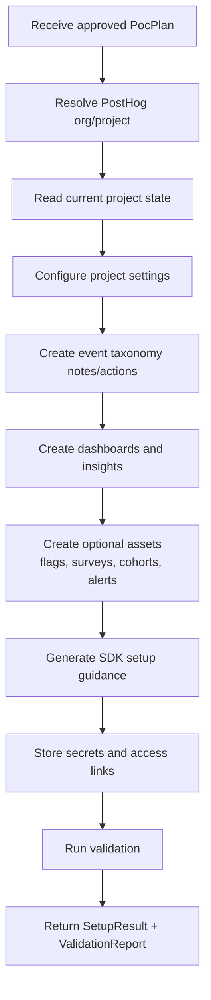

# PostHog PoC Setup Plan

## Role

The PostHog PoC setup agent receives an approved `PocPlan` and configures a target PostHog project. It is intentionally PostHog-specific.

## Setup Inputs

- Approved `PocPlan`.
- Target PostHog organization and project context.
- PostHog MCP/API credentials with minimal required scope.
- Customer contacts and desired access model.
- Secrets manager API.
- Validation runner API.

## Setup Outputs

- `SetupResult`
- `ValidationReport`
- PostHog project URL.
- Dashboard and insight URLs.
- Feature flag, survey, cohort, alert, and subscription IDs.
- Secure credential references.
- Known gaps and manual follow-ups.

## Setup Flow

## Project Resolution

Preferred MVP approach:

1. Use an existing PostHog organization.
2. Use an existing project or a pre-created blank PoC project.
3. Pin MCP session to the target organization/project.

Project creation may require a separate admin API or Terraform-backed tool if PostHog MCP does not expose project creation in the current tool list. Keep that as an explicit `posthog_project_create` internal admin tool, not as an LLM-discovered action.

## Configuration Phases

### Phase 1: Preflight

Checks:

- MCP authentication works.
- Correct PostHog organization/project is selected.
- The project URL can be derived.
- The agent can read project settings.
- The allowed tool surface is constrained.
- Required plan fields exist.

PostHog MCP tools:

- `projects-get`
- `project-get`
- `organization-get`
- `docs-search`

### Phase 2: Project settings

Configure only approved settings.

Possible settings:

- Project name or display metadata.
- Timezone.
- Authorized domains.
- Session replay defaults.
- Autocapture guidance.
- PII masking assumptions.
- Data region notes.

PostHog MCP tools:

- `project-get`
- `project-settings-update`

### Phase 3: Event taxonomy and actions

Translate customer goals into event definitions and actions.

Examples:

- `$pageview`
- `user_signed_up`
- `signup_completed`
- `trial_started`
- `checkout_started`
- `purchase_completed`
- `invite_sent`
- `feature_used`

Create actions for business-readable behavior such as:

- "Completed signup"
- "Activated account"
- "Started checkout"
- "Completed purchase"
- "Used core feature"

PostHog MCP tools:

- `action-create`
- `action-update`
- `action-get`
- `actions-get-all`
- `event-definition-update`
- `read-data-schema`

### Phase 4: Dashboards and insights

Create a PoC dashboard that maps directly to success criteria.

Recommended dashboard tiles:

- PoC overview text tile with goal, assumptions, and test window.
- Daily active users or unique visitors.
- Signup funnel.
- Activation funnel.
- Core feature usage trend.
- Retention or repeat usage.
- Top paths if web analytics is relevant.
- Session replay checklist if session replay is enabled.

PostHog MCP tools:

- `dashboard-create`
- `dashboard-create-text-tile`
- `dashboard-widgets-batch-add`
- `dashboard-get`
- `dashboard-widgets-run`
- `dashboard-reorder-tiles`
- `insight-create`
- `insight-get`
- `insights-list`
- `insight-query`
- `query-trends`
- `query-funnel`
- `query-retention`
- `query-paths`

### Phase 5: Optional PostHog assets

Only create these when the approved plan requests them.

Feature flags:

- `create-feature-flag`
- `update-feature-flag`
- `feature-flag-get-all`
- `feature-flag-get-definition`
- `feature-flags-test-evaluation-create`
- `feature-flags-user-blast-radius-create`

Experiments:

- `experiment-create`
- `experiment-get`
- `experiment-list`
- `experiment-update`
- `experiment-launch`
- `experiment-results-get`

Surveys:

- `survey-create`
- `survey-launch`
- `survey-get`
- `survey-stats`
- `surveys-get-all`

Cohorts:

- `cohorts-create`
- `cohorts-list`
- `cohorts-retrieve`
- `cohorts-partial-update`

Alerts/subscriptions:

- `alert-create`
- `alert-simulate`
- `alerts-list`
- `subscriptions-create`
- `subscriptions-test-delivery-create`

CDP/functions:

- `cdp-function-templates-list`
- `cdp-function-templates-retrieve`
- `cdp-functions-create`
- `cdp-functions-invocations-create`
- `cdp-functions-logs-retrieve`
- `cdp-functions-retrieve`

Session replay:

- `query-session-recordings-list`
- `session-recording-get`
- `session-recording-playlist-create`
- `session-recording-playlist-get`
- `session-recording-summarize`

### Phase 6: SDK setup guidance

The system should not assume it can edit the customer's application code. Instead, generate implementation guidance:

- PostHog host URL.
- Project API key delivery reference.
- SDK install command for the customer's stack.
- Initialization snippet.
- Identify/group usage.
- Capture event examples.
- Feature flag usage examples if needed.
- Local test instructions.

If the customer's app repository is later connected, a separate code implementation workflow can make the code changes.

### Phase 7: Validation

Validation should produce a pass/warn/fail report.

Current implementation note: unexpected PostHog setup or MCP tool failures are normalized into a failed `SetupResult` with a failed validation report. The workflow persists that result and moves the PoC to human review instead of losing state.

Checks:

- Project context is correct.
- Expected actions exist.
- Dashboard exists and widgets run.
- Test events are ingested, if a test event sender is available.
- Schema includes expected events/properties after ingestion.
- Feature flag evaluation works for test users, if flags were created.
- Survey exists and launch status is correct, if surveys were created.
- Alerts simulate successfully, if alerts were created.
- No raw secrets are present in handoff text.

Validation tools:

- `read-data-schema`
- `execute-sql`
- `dashboard-widgets-run`
- `insight-query`
- `query-trends`
- `query-funnel`
- `query-retention`
- `query-paths`
- `feature-flags-test-evaluation-create`
- `survey-get`
- `alert-simulate`
- `sdk-doctor-get`

## Idempotency Strategy

All setup operations should use stable naming:

- Dashboard: `PoC - {customerCompany} - {pocId}`
- Actions: `{pocId}: {actionName}`
- Insights: `{pocId}: {insightName}`
- Feature flags: `{companySlug}-{pocSlug}-{flagKey}`
- Surveys: `PoC {pocId}: {surveyName}`
- Tags: `poc:{pocId}`, `source:poc-automation`

Before creating, list or query for matching names/tags. Update when safe; otherwise create a new version and record it.

## Destructive Operations

Require human approval before:

- Deleting feature flags.
- Bulk deleting feature flags.
- Deleting persons.
- Deleting dashboards or insights.
- Archiving workflows.
- Ending or launching experiments.
- Deleting CDP functions.
- Destroying data sources.

## Setup Result Summary

The setup agent must return structured output, not only prose.

Minimum result fields:

- `pocId`
- `posthogProjectId`
- `posthogProjectUrl`
- `createdResources`
- `updatedResources`
- `skippedResources`
- `credentialRefs`
- `sdkInstructions`
- `validationReport`
- `knownGaps`
- `handoffInputs`
