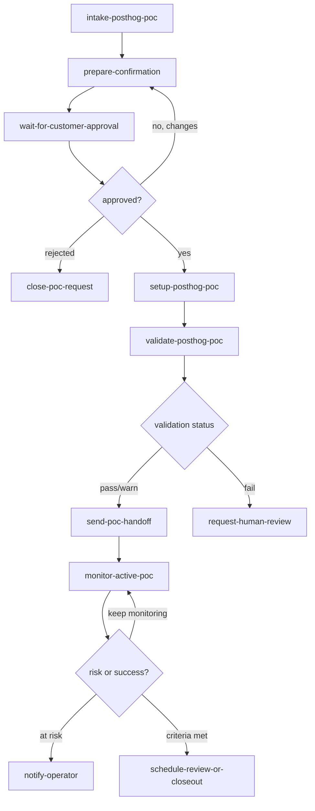
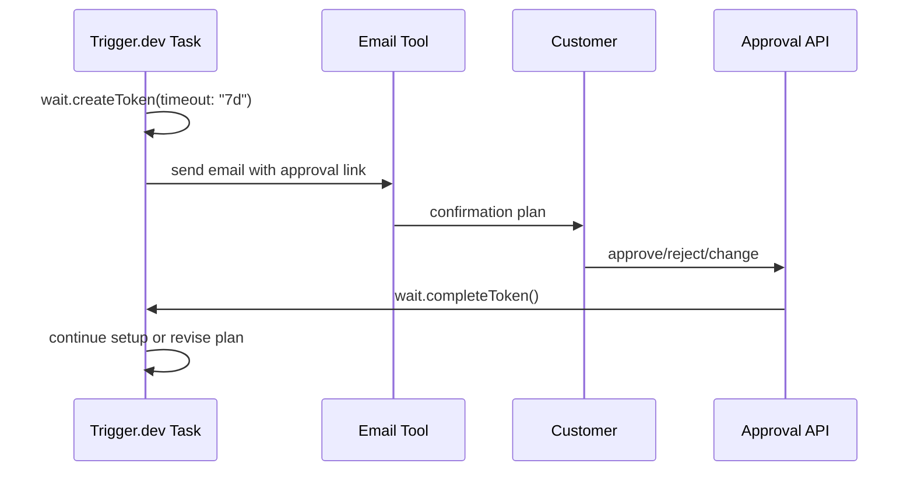

# Trigger.dev Workflow Plan

Use Trigger.dev as the workflow runner for durable, observable, retryable jobs.

Trigger.dev is useful for this system because it supports long-running tasks, automatic retries, queues, realtime run updates, and waitpoint tokens for human-in-the-loop approval.

## Trigger.dev Cloud Assumptions

For this PoC, use Trigger.dev Cloud as the workflow runner for all nontrivial background work:

- Intake processing.
- Confirmation email preparation.
- Human approval waitpoints.
- Approved setup execution.
- Inbound Gmail MCP reply polling/processing.
- PostHog validation.
- Handoff generation.
- Scheduled and on-demand monitoring.

The local `WORKFLOW_MODE=local` path exists only for offline demos and tests. The expected hackathon path is `WORKFLOW_MODE=trigger`.

What the project needs from the operator:

- A Trigger.dev project ref, exposed as `TRIGGER_PROJECT_REF`.
- A Trigger.dev secret key for the API server to trigger tasks, exposed as `TRIGGER_SECRET_KEY`.
- A Trigger.dev access token for deploys, exposed as `TRIGGER_ACCESS_TOKEN`.
- The worker environment variables from `.env.example`.
- A Gmail OAuth setup for either direct send via Gmail API `users.messages.send` or reviewable drafts via official Gmail MCP `create_draft`.
- A Gmail MCP runtime bridge for inbox tools: `search_threads`, `get_thread`, and optionally `label_thread`.
- PostHog MCP credentials and a pre-created PostHog project ID.
- A public API URL if approval links or Gmail callbacks need to reach the local HTTP server.

## Task Graph



## Tasks

### `intake-posthog-poc`

Triggered by the orchestrator intake API or file importer after a requirements text blob is received.

Responsibilities:

- Store intake payload.
- Generate `pocId`.
- Normalize requirements.
- Trigger `prepare-confirmation`.

Idempotency:

- Use source ID or file hash if available.
- Otherwise use a hash of primary customer email + received timestamp + product.

### `prepare-confirmation`

Responsibilities:

- Generate `PocRequirements`.
- Generate `PocPlan` draft.
- Generate confirmation email.
- Create waitpoint token.
- Send email.
- Set lifecycle state to `confirmation_sent`.

### `wait-for-customer-approval`

Responsibilities:

- Wait for approval token completion.
- Support completion by approval link or inbox classifier.
- Route approved, rejected, or changed plans.

Use Trigger.dev waitpoint tokens.

### `setup-posthog-poc`

Responsibilities:

- Resolve PostHog org/project.
- Pin MCP session to target context.
- Execute approved setup plan.
- Store created resources.
- Store credential references.
- Trigger validation.

Queue:

- One active setup run per PostHog project.

Idempotency:

- `poc:{pocId}:setup:v{planVersion}`

### `validate-posthog-poc`

Responsibilities:

- Send synthetic events if possible.
- Run PostHog schema and query checks.
- Validate dashboards and optional assets.
- Return `ValidationReport`.

Retry policy:

- Retry ingestion/schema checks with backoff because PostHog event visibility may be eventually consistent.
- Do not hide warnings. Include them in handoff.

### `send-poc-handoff`

Responsibilities:

- Generate `HandoffPackage`.
- Verify no raw secrets are present.
- Send email.
- Set lifecycle state to `handoff_sent` or `handoff_sent_with_gaps`.

### `monitor-gmail-inbox`

Responsibilities:

- Search inbound email threads with Gmail MCP `search_threads`.
- Fetch full thread bodies with Gmail MCP `get_thread` using `FULL_CONTENT`.
- Normalize official Gmail MCP message fields into the canonical inbound email shape.
- Classify replies.
- Complete approval waitpoints when appropriate.
- Escalate unclear responses.
- Optionally label processed threads using Gmail MCP `label_thread` and configured label IDs.

Configuration:

- `GMAIL_INBOX_QUERY`: Gmail syntax query, default `in:inbox newer_than:7d -in:draft`.
- `GMAIL_INBOX_MAX_THREADS`: maximum threads per run, capped at 50.
- `GMAIL_PROCESSED_LABEL_IDS`: comma-separated Gmail label IDs, not names.
- `GMAIL_MCP_ENDPOINT`: defaults to `https://gmailmcp.googleapis.com/mcp/v1`.
- `GMAIL_MCP_ACCESS_TOKEN`: OAuth bearer token for this PoC bridge.

Note: official Gmail MCP currently creates drafts for outbound mail with `create_draft`; it does not expose a direct send-email tool. Use `EMAIL_MODE=gmail_api` when the PoC should send directly through Gmail REST `users.messages.send`, or `EMAIL_MODE=gmail_mcp` when a human should review/send drafts from Gmail.

### `monitor-active-posthog-poc`

Scheduled task for PoCs in `active_poc`, `handoff_sent`, or `handoff_sent_with_gaps`.

Responsibilities:

- Load approved `PocPlan`, `SetupResult`, latest `ValidationReport`, and previous monitoring reports.
- Query PostHog for real customer activity in the monitoring window.
- Compare event usage, unique users, funnel progress, dashboard/insight activity, surveys, flags, and recordings against success criteria.
- Detect plan drift such as missing expected events, unexpected observed events, identity issues, synthetic-only traffic, or wrong environment data.
- Store `PocMonitoringReport`.
- Update lifecycle state to `active_poc`, `monitoring_at_risk`, `monitoring_criteria_met`, or `needs_human_review`.
- Draft operator/customer follow-up when action is needed.

Cadence:

- Daily for the first 7 days after handoff.
- On demand from the operator API/UI.
- 24 hours before `handoffPlan.reviewDate`, if present.
- Weekly after the first week until teardown or completion.

Current implementation:

- On-demand and Trigger-invoked runs use the same `PocMonitoringAgent`.
- Event activity is read through MCP `execute-sql`.
- Dashboard health is checked with MCP `dashboard-widgets-run`.
- Reports are stored and exposed through `GET /pocs/:pocId/monitoring`.

Idempotency:

- `poc:{pocId}:monitor:{windowStart}:{windowEnd}`

Queue:

- One active monitor run per `pocId`.

Risk routing:

- `inactive`: credential link unused or no real events after handoff.
- `at_risk`: some activity, but success criteria are not progressing.
- `blocked`: setup or customer action is preventing validation.
- `criteria_met`: evidence exists for all required success criteria.
- `unknown`: data is insufficient or PostHog read checks failed.

### `teardown-posthog-poc`

Later-phase task, not required for the first demo.

Responsibilities:

- Revoke temporary secrets.
- Disable temporary access.
- Archive or tag PoC resources.
- Send completion or cleanup summary.

## Waitpoint Approval Pattern



## Pseudo-Code

```ts
import { task, wait } from "@trigger.dev/sdk";

export const prepareConfirmation = task({
  id: "prepare-posthog-poc-confirmation",
  run: async (payload: { pocId: string }) => {
    const requirements = await extractPocRequirements({ pocId: payload.pocId });
    const plan = await generatePocPlan({ pocId: payload.pocId, requirements });

    const token = await wait.createToken({
      timeout: "7d",
      idempotencyKey: `poc:${payload.pocId}:approval:v${plan.version}`,
      tags: [`poc:${payload.pocId}`, "product:posthog"],
    });

    await sendEmail({
      to: plan.customer.contacts.map((c) => c.email),
      subject: `Please confirm your PostHog PoC plan`,
      markdownBody: renderConfirmationEmail(plan, token.publicAccessToken),
      tags: [`poc:${payload.pocId}`],
    });

    const decision = await wait.forToken<{
      decision: "approved" | "rejected" | "needs_changes";
      decidedBy: string;
      changes?: string[];
    }>(token.id).unwrap();

    if (decision.decision === "approved") {
      return await setupPosthogPoc.triggerAndWait({
        pocId: payload.pocId,
        planVersion: plan.version,
      });
    }

    if (decision.decision === "needs_changes") {
      return await prepareConfirmation.triggerAndWait({
        pocId: payload.pocId,
        changes: decision.changes ?? [],
      });
    }

    return { status: "rejected" };
  },
});
```

## Retry Policy

Recommended defaults:

- Email send: retry 3 times with exponential backoff.
- Inbox check: scheduled retry, no hard failure for empty inbox.
- MCP read calls: retry 3 times.
- MCP create/update calls: retry only if idempotent lookup confirms no duplicate was created.
- Synthetic event validation: retry over 5 to 15 minutes.
- Active PoC monitoring: retry read failures 3 times, but store a warning report if PostHog data is unavailable.
- Handoff send: retry 3 times, then escalate.

## Metadata and Tags

Attach these tags to every Trigger.dev run:

- `poc:{pocId}`
- `product:posthog`
- `customer:{companySlug}`
- `stage:{stageName}`

Run metadata:

```ts
type RunMetadata = {
  pocId: string;
  customerCompany: string;
  product: "posthog";
  lifecycleStatus: PocLifecycleStatus;
  planVersion?: number;
  posthogProjectId?: string;
  currentStep?: string;
};
```

## Realtime Status UI

Optional for the hackathon demo:

- Use Trigger.dev realtime run updates for an internal operator dashboard.
- Show lifecycle state, active task, logs, created resources, and blocking issues.
- Do not expose raw tool call payloads containing secrets.
