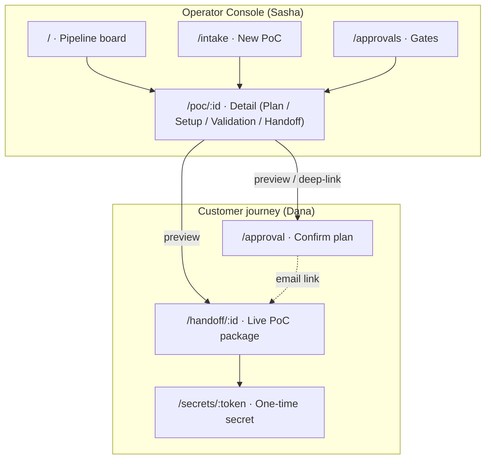
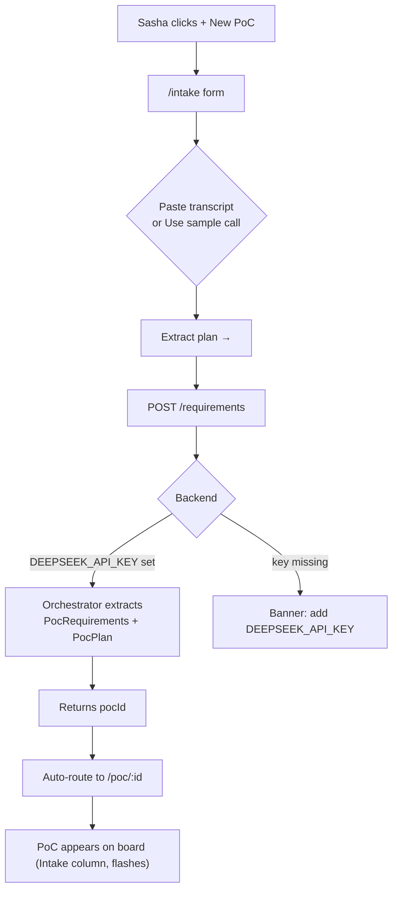
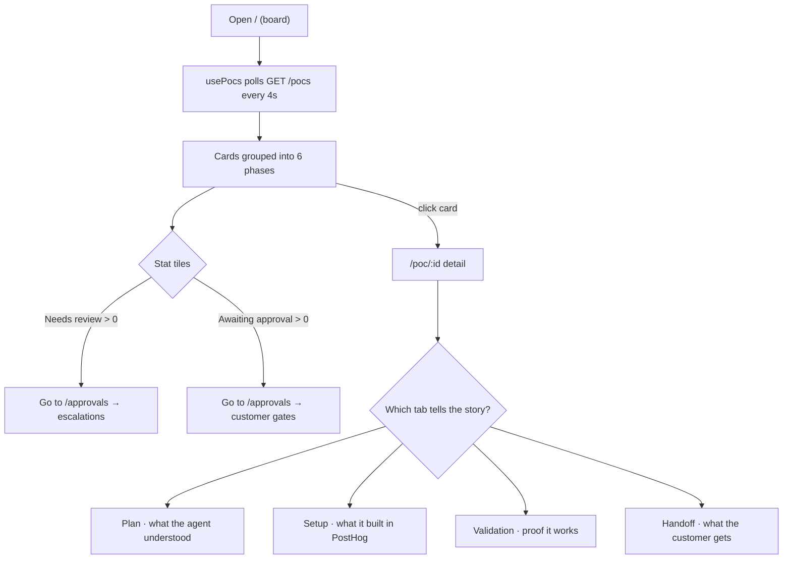
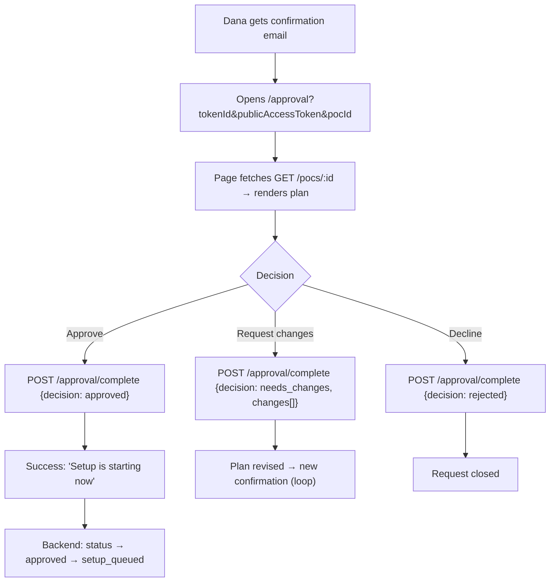
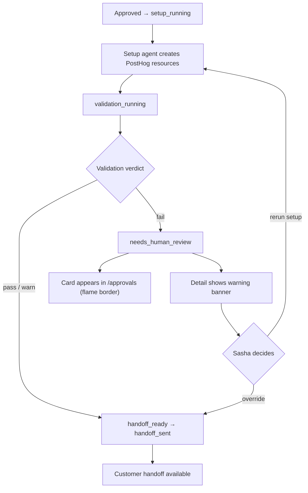
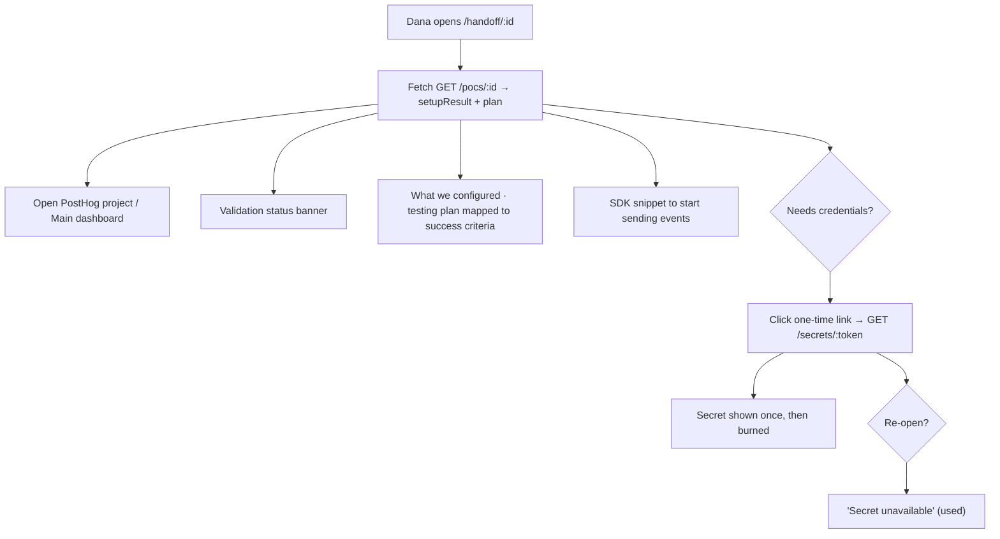

# PoC Pilot — User Flows

These flows show how the two humans move through PoC Pilot's screens, and where the
UI touches the real backend API. Routes and endpoints are exactly what's implemented
in `web/` and `src/server/http-server.ts`.

---

## Flow 0 — Map of surfaces

---

## Flow 1 — Operator turns a call into a plan (US-O11)

**Trust boundary:** the pasted text is untrusted. It shapes the plan but never
executes a tool call. Setup cannot start here — only after the approval gate (Flow 3).

---

## Flow 2 — Operator triages the pipeline (US-O1, O2, O8)

---

## Flow 3 — Customer confirms the plan (US-C1, C2, C3)

The operator can preview or drive this exact page from `/poc/:id` via **Open approval
page** (US-O9), so Sasha and Dana see the same artifact.

---

## Flow 4 — Setup, validation, and the human-review gate (US-O7, O10)

While a PoC is in `setup_running` or `validation_running`, its board card shows a live
pulse dot (US-O3) so Sasha can watch progress without opening it.

---

## Flow 5 — Customer receives the handoff (US-C4, C5, C6)

---

## Edge & failure states the UI handles

| Condition | What the user sees |
|---|---|
| Backend unreachable | Board shows a red banner with the start command; sidebar status dot turns red |
| No PoCs in a phase | Column renders an "Empty" ticker tile, not a blank gap |
| Intake without `DEEPSEEK_API_KEY` | Friendly banner telling the operator to set the key and restart |
| PoC not found (`/poc/:id`) | "PoC not found" page with the error and a back link |
| Validation `fail` | Detail warning banner + `/approvals` escalation card; handoff held |
| Secret link reused/expired | Branded "Secret unavailable" page (`used` / `expired` / `not_found`) |
| Approval link missing tokens | Approval page disables actions and tells the buyer to reply to the email |
