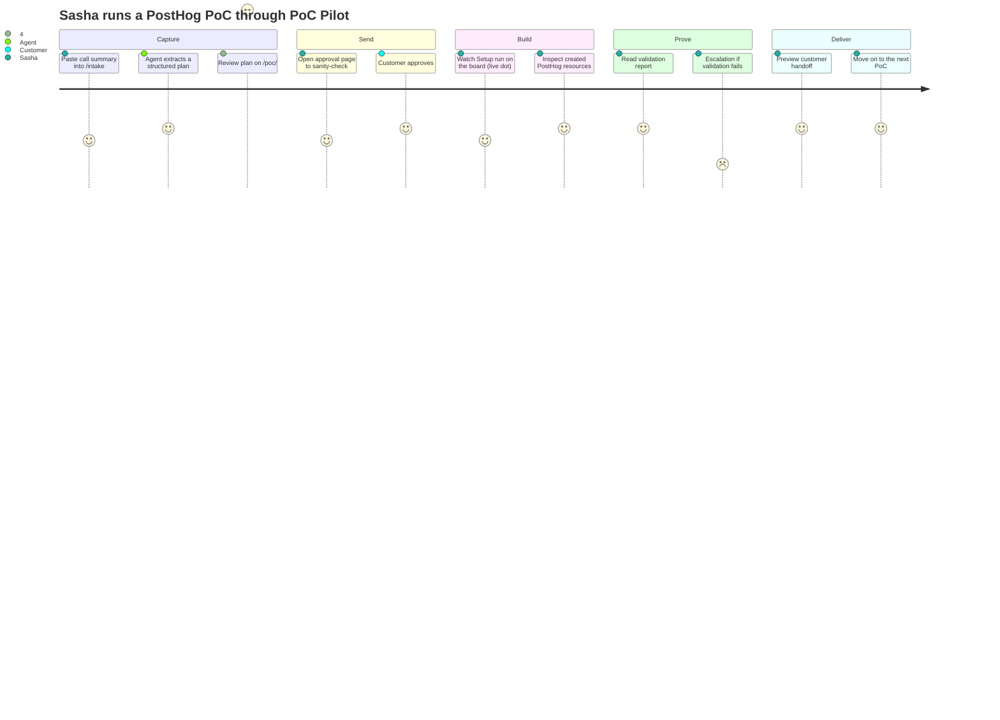
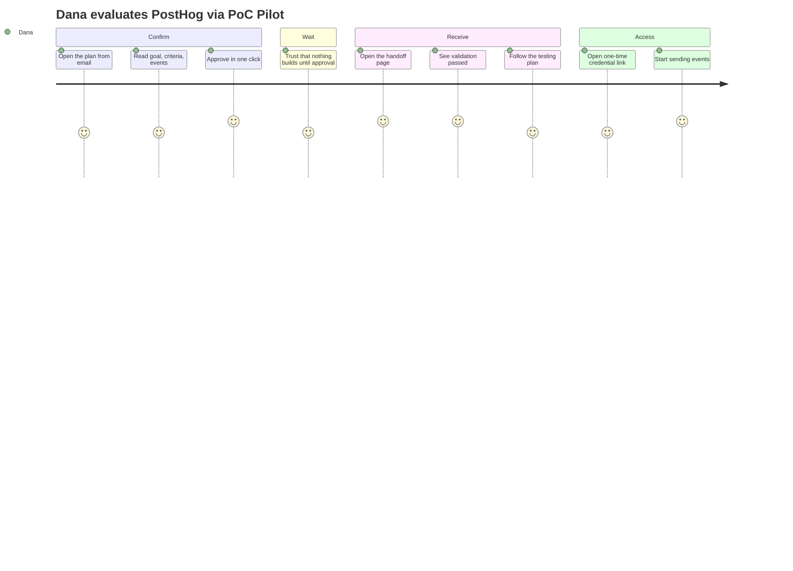
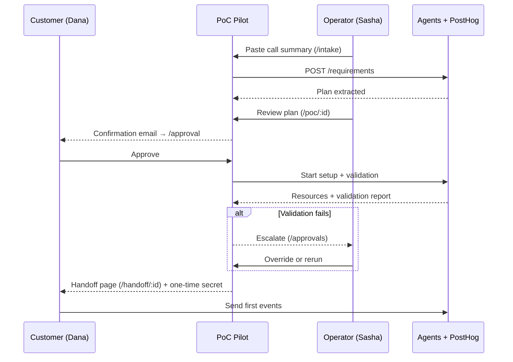

# PoC Pilot — Journey Maps

Two end-to-end journeys, one per persona, showing phases, what happens, the touchpoint
in PoC Pilot, and the emotional arc. These extend the high-level journey in the repo's
root `DESIGN.md` with the concrete screens now built in `web/`.

---

## Journey A — Sasha (Solutions Engineer): "From call to confident handoff"

### Detail

| Phase | What Sasha does | Touchpoint | Feeling | Where PoC Pilot helps |
|---|---|---|---|---|
| Capture | Pastes the discovery-call summary | `/intake` | "Finally, no manual setup" | One textarea + sample call; the agent does the structuring |
| Capture | Skims the extracted plan | `/poc/:id` Plan tab | Slight skepticism | Plan rendered as events, dashboards, security — easy to fault-check |
| Send | Confirms the plan is right, then watches for sign-off | `/approvals`, detail | Anticipation | Awaiting-approval bucket means nothing stalls silently |
| Build | Glances at the board while doing other work | `/` board | Calm | Live pulse on Setup/Validation cards; no need to babysit |
| Build | Verifies what was actually created | Setup & Resources tab | Trust building | Deep links straight into PostHog; skipped items are explicit |
| Prove | Reads the per-check report before promising "ready" | Validation tab | Confidence (or alarm) | pass/warn/fail with evidence; failures **block** handoff |
| Prove | Handles an escalation | `/approvals` + detail banner | Brief stress → resolved | The one PoC that needs her is surfaced, not buried |
| Deliver | Previews the customer's handoff page | `/handoff/:id` | Pride | The customer gets something polished she didn't hand-assemble |

**Emotional low point:** validation `fail` (Stark Industries in the seed). PoC Pilot
turns that from a silent landmine into a surfaced, explained, fixable item — the design
goal is to make the low point *short and legible*, not invisible.

---

## Journey B — Dana (Customer): "From confused to confident"

### Detail

| Phase | What Dana does | Touchpoint | Feeling | Where PoC Pilot helps |
|---|---|---|---|---|
| Confirm | Reads the plan on one screen | `/approval` | "This is the right thing" | Goal + success criteria + events + open questions, no jargon wall |
| Confirm | Approves / asks for a tweak | `/approval` actions | In control | Three clear actions; explicit "nothing builds until you say go" |
| Wait | Does nothing, waits | (email) | Reassured | Approval copy sets the expectation; no credential threads |
| Receive | Opens the handoff | `/handoff/:id` | Delight | One page: links, what was built, testing plan, validation badge |
| Receive | Checks it actually works | validation banner | Trust | "Validation pass" with a plain-language summary |
| Access | Gets credentials safely | one-time link → `/secrets/:token` | Safe | Secret shown once then burned; never raw in email |
| Access | Sends a first event | SDK snippet on handoff | Momentum | Copy-paste `posthog.init(...)` ready to go |

**Trust spine:** every step reinforces that customer input is respected and credentials
are handled safely — the two things buyers actually worry about in a PoC.

---

## How the journeys interlock

The product's whole reason to exist sits in the two `-->>` arrows from Pilot to Dana:
those used to be hand-written emails. PoC Pilot makes them generated, consistent, and
backed by real validation — while keeping Sasha in control at the two gates that matter.
