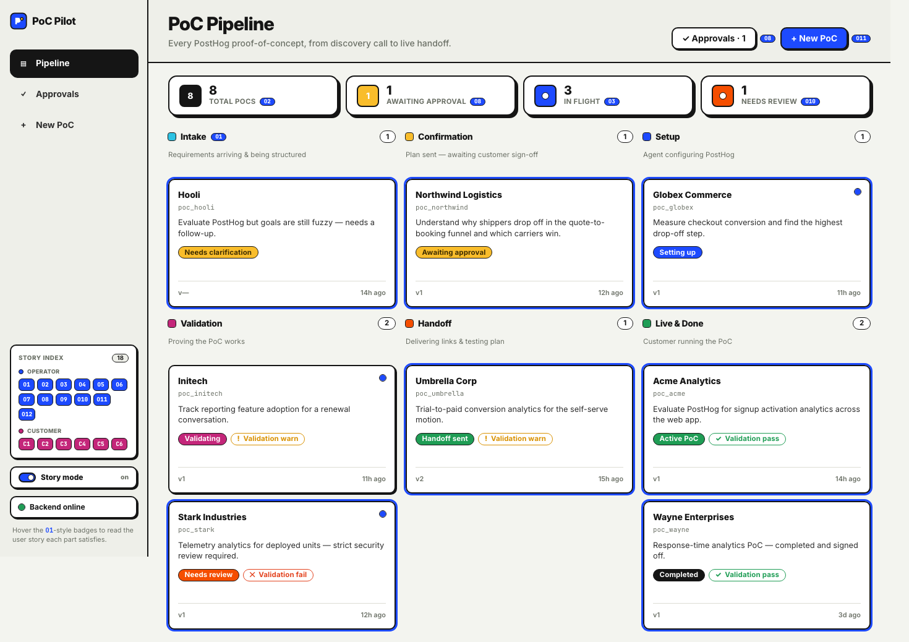
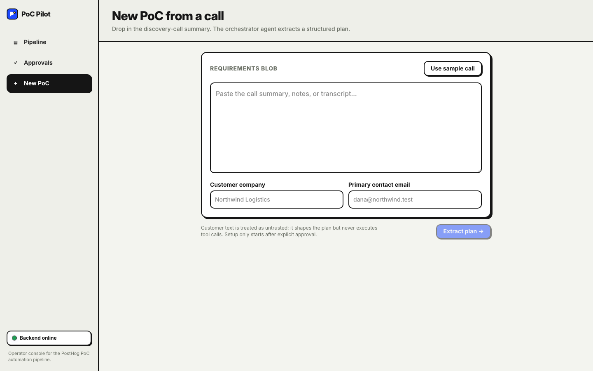
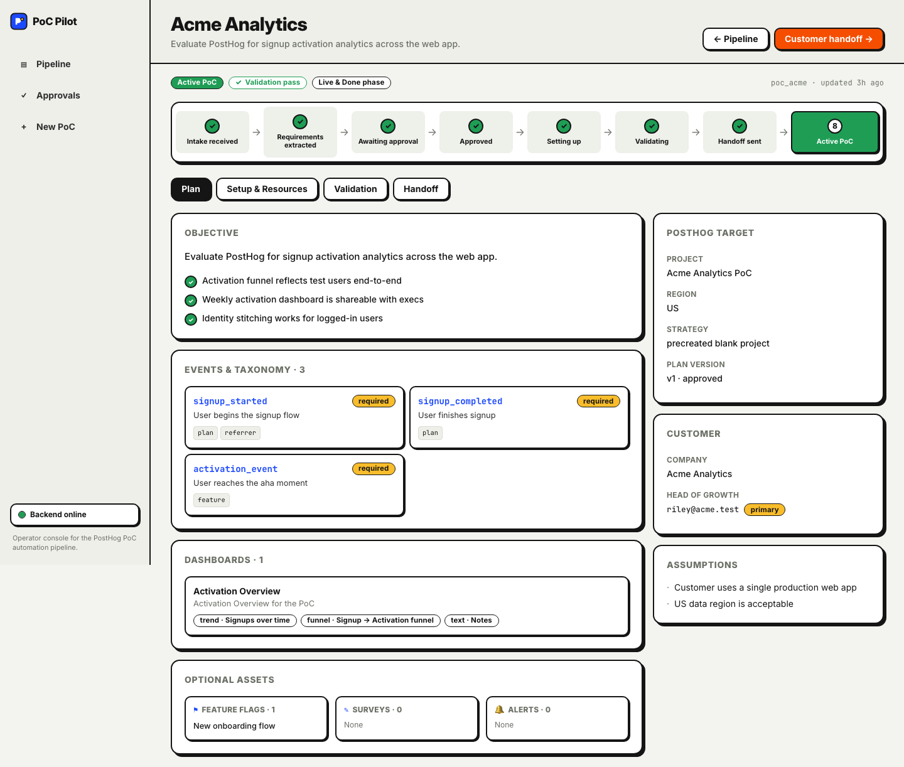
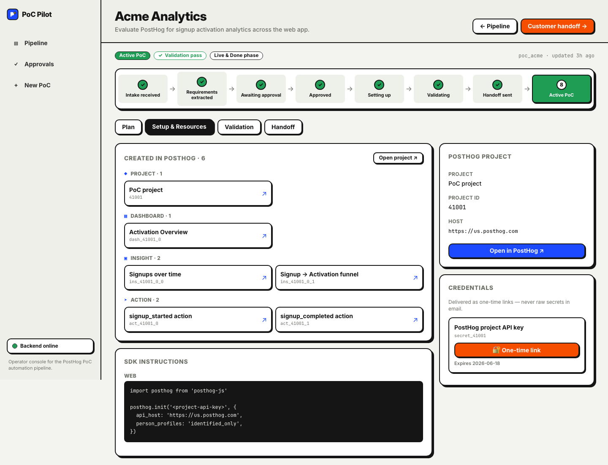
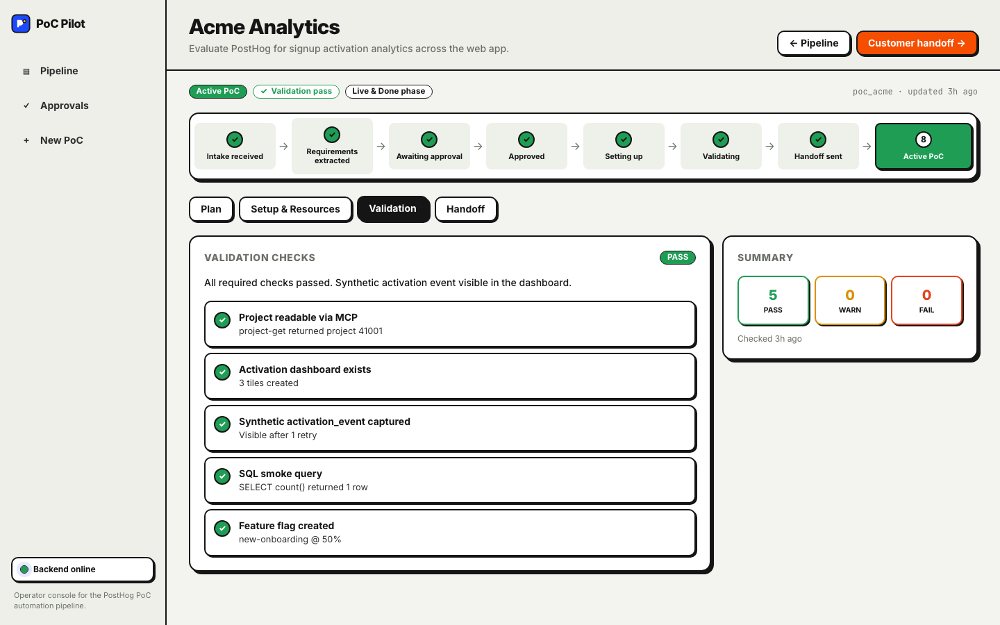
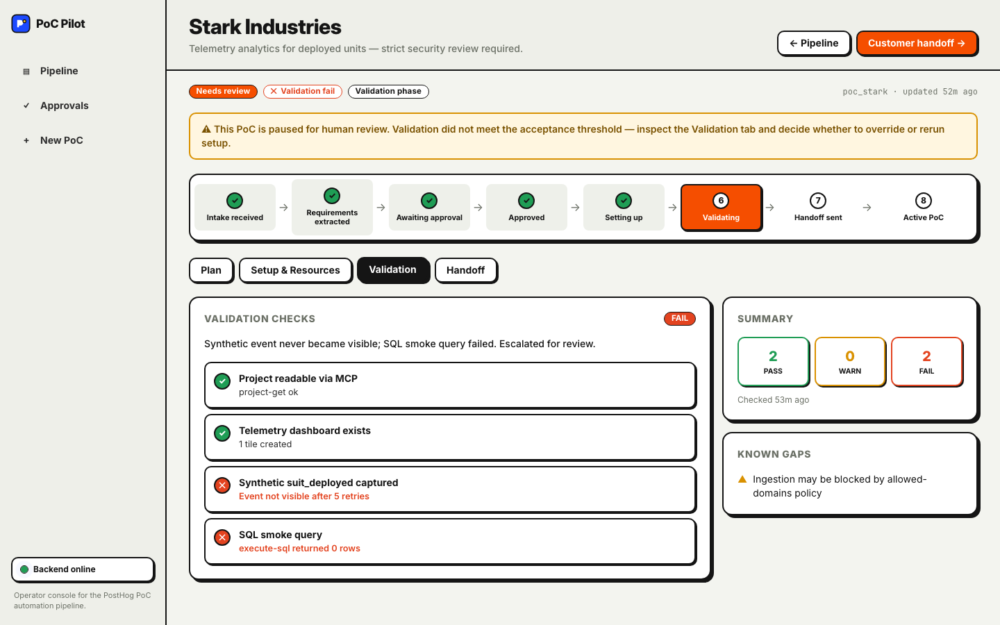
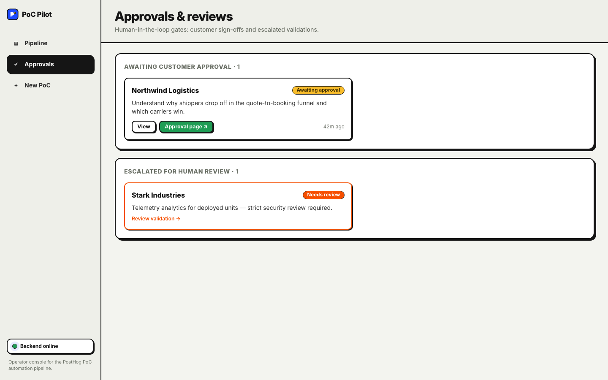
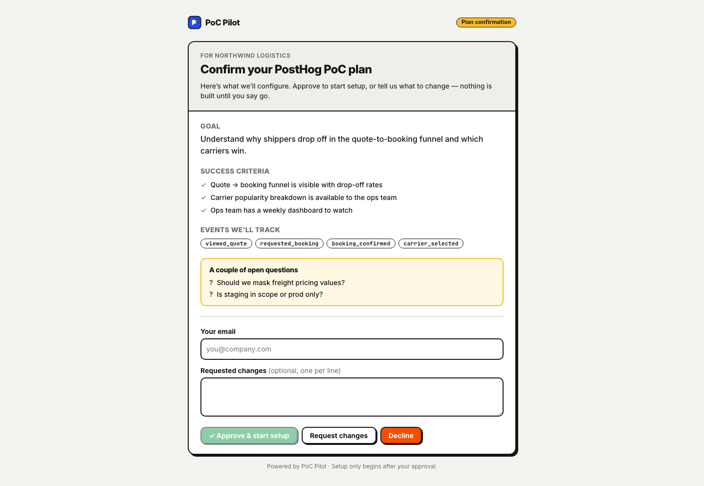
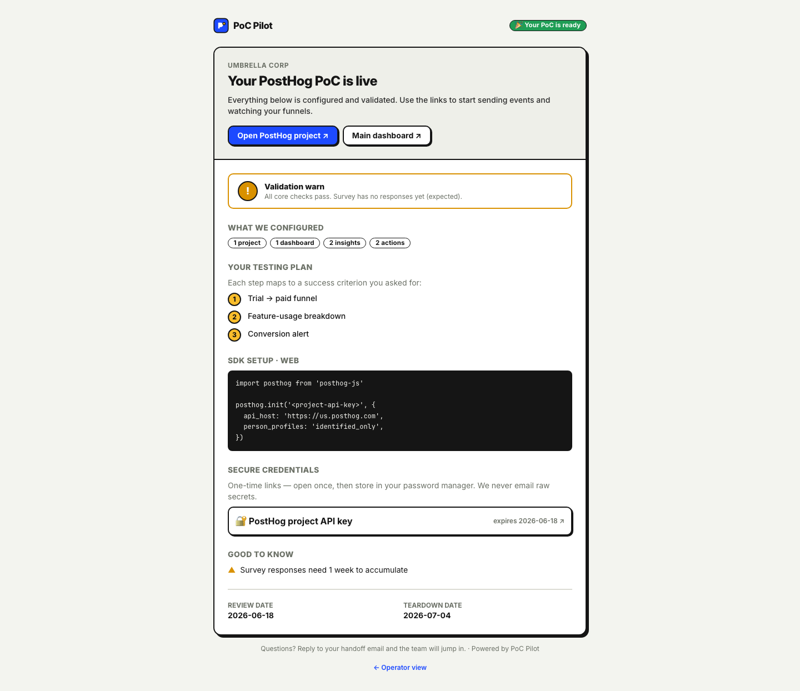

# PoC Pilot — Automated Walkthrough

These frames were captured from the **live app** (Vite `:5173` proxying the real Node
backend on `:3000`, seeded with `npm run seed`). They follow the demo script's narrative
order and double as a visual storyboard. No console errors on any route.

---

## 1 · The pipeline board — every PoC, one screen
`/` — 8 PoCs grouped into 6 phases; live stat tiles; validation badges.



> The operator's home. 18 backend lifecycle states collapse into 6 human phases.
> "In flight" and "Needs review" pulse so the eye goes where the work is.

---

## 2 · New PoC — a call becomes a plan
`/intake` — paste a discovery-call summary; the orchestrator agent extracts the plan.



> Customer text shapes the plan but never triggers setup. `POST /requirements` →
> structured `PocRequirements` + `PocPlan` (needs `DEEPSEEK_API_KEY` for the live run).

---

## 3 · PoC detail — what the agent understood
`/poc/:id` Plan tab — lifecycle stepper + objective, success criteria, event taxonomy.



---

## 4 · Setup & Resources — what it built in PostHog
Every created resource grouped by type, each a real deep link; project + one-time creds.



---

## 5 · Validation — proof it works
Green per-check report. Synthetic events fired, SQL smoke check, dashboard present.



---

## 6 · The safety net — validation fail → human review
A failing PoC is held automatically: warning banner, flame stepper node, FAIL checks,
and an escalation card in `/approvals`. No broken PoC reaches a customer.



---

## 7 · Approvals & reviews — the two human gates
`/approvals` — PoCs awaiting customer sign-off and PoCs escalated for review.



---

## 8 · Customer approval — one screen, one click
`/approval` — the buyer confirms goal, success criteria, events, and open questions.



> Approve, request changes, or decline. "Setup only begins after your approval."

---

## 9 · Customer handoff — the delivered PoC
`/handoff/:id` — project links, validation status, a testing plan mapped to the
customer's success criteria, the SDK snippet, and secure one-time credential links.



---

### Reproduce

```bash
# repo root
npm run build && npm run seed && npm run api:start
# second terminal
cd web && npm install && npm run dev
# then drive http://localhost:5173 (board → intake → /poc/:id tabs → /approval → /handoff/:id)
```
